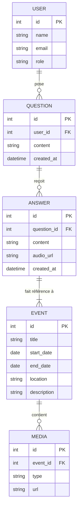

# TimeWhisper

TimeWhisper est une application web interactive qui permettra aux utilisateurs de poser des questions orales sur des événements historiques et d’obtenir des réponses **vocales et visuelles**.

---

## Objectif

- Fournir des résumés historiques fiables  
- Relier documents d’archives  
- Afficher les événements sur une **timeline interactive**  

---

## Public cible

- Étudiants

---

## Technologies prévues

- **Front-end :** HTML5, CSS3, JavaScript, TypeScript, React, Bootstrap / TailwindCSS  
- **Back-end :** PHP / Laravel  
- **Base de données :** MongoDB  
- **API :** REST API  
- **Données et multimédia :** JSON / XML, D3.js (visualisation de données), WebRTC (communication temps réel)  
- **Outils :** Git / GitHub / GitLab  
- **IA / NLP :** Whisper API (transcription vocale), Llama (génération contextuelle), No-code / Low-code

---

## Fonctionnalités prévues

- Moteur de recherche  
- Carte interactive  
- Système de filtres et tris  
- Chatbot ou assistant virtuel  
- Timeline dynamique  
- Galerie multimédia  

---
## Diagramme Entité-Relation

## Lien du projet

[GitHub Repository](https://github.com/Zackbellaj/TimeWhisper)
